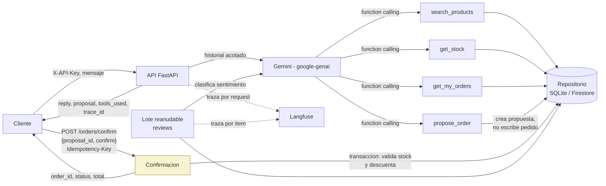

# Arquitectura de VendeBot

## Vision general (objetivo final)

El punto marcado en amarillo (`CONFIRM`) es el control explicito antes de la
accion sensible: el LLM solo propone (`propose_order`), nunca escribe un
pedido ni descuenta stock. Eso ocurre unicamente cuando el cliente confirma
de forma explicita en `POST /orders/confirm`, con `Idempotency-Key` para que
una confirmacion repetida no duplique el pedido.

## Estado implementado

Todo el diagrama de arriba esta implementado: `/chat` con las 4
herramientas, el flujo propuesta -> confirmacion con idempotencia, el lote
reanudable, y las trazas de Langfuse en cada request de chat y cada item del
lote. El repositorio soporta SQLite (local/tests, usado en toda la
verificacion) y Firestore (para GCP, implementado contra la documentacion
oficial pero sin probar contra un proyecto real -- ver README, seccion
"Cuentas y llaves").

## Decisiones de arquitectura

- **Patron repositorio para la persistencia**: la logica de negocio no debe
  saber si los datos viven en SQLite o Firestore. `STORAGE_BACKEND` selecciona
  la implementacion sin tocar el resto del codigo.
- **Interfaz `LLMClient`**: aisla el SDK de Gemini para poder sustituirlo por
  un doble de prueba en los tests unitarios, sin llamar al proveedor real.
- **Propuesta como paso intermedio**: separar "proponer" de "confirmar" es lo
  que permite declarar una accion sensible (descontar stock) bajo control
  explicito del cliente, en vez de dejar que el LLM decida cuando escribir.
